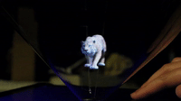

# Pepper's Cone: An Inexpensive Do-It-Yourself 3D Display
This repo contains code to display 3D objects given calibrated pre-distortion map. More information see our [paper][http://roxanneluo.github.io/PeppersCone.html].

    

## Demo
### Mono
### Stereo

## Citation

## Contact
If you have any questions, please email Xuan Luo at
<xuanluo@cs.washington.edu>.

